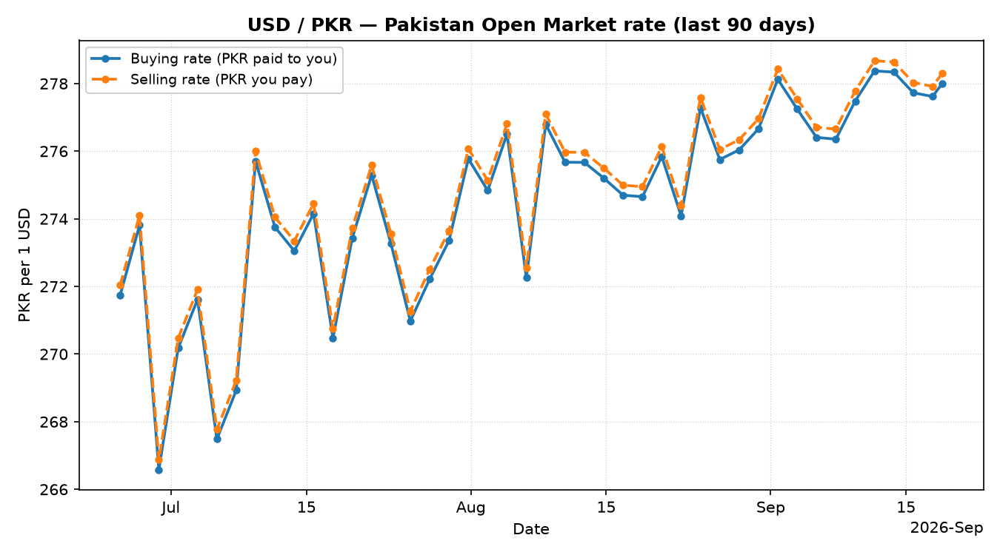
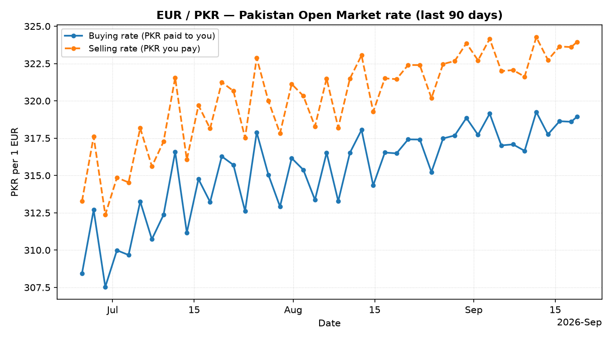
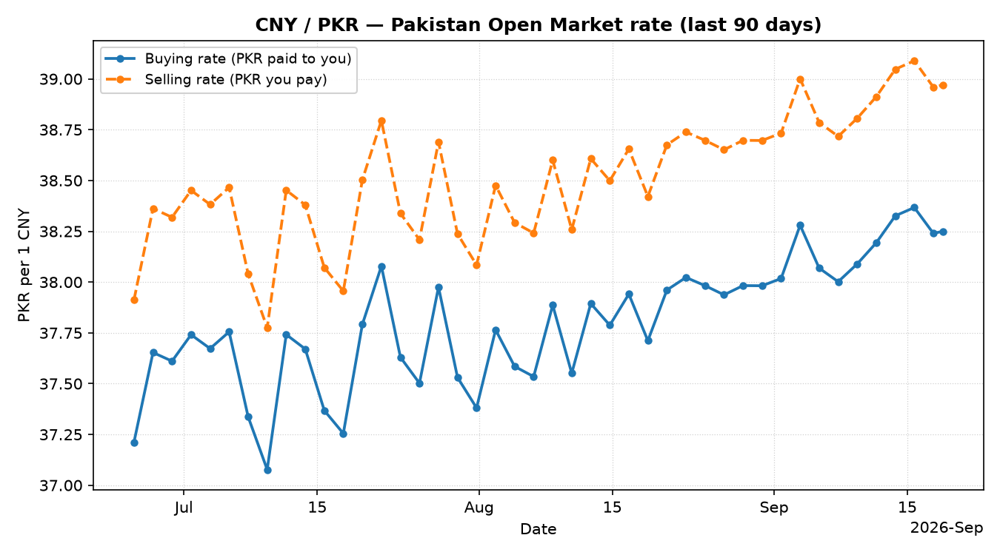
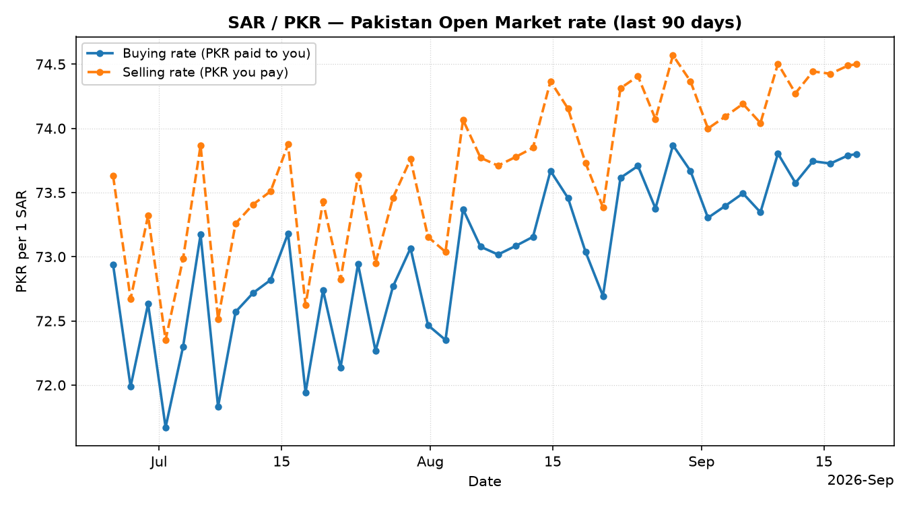
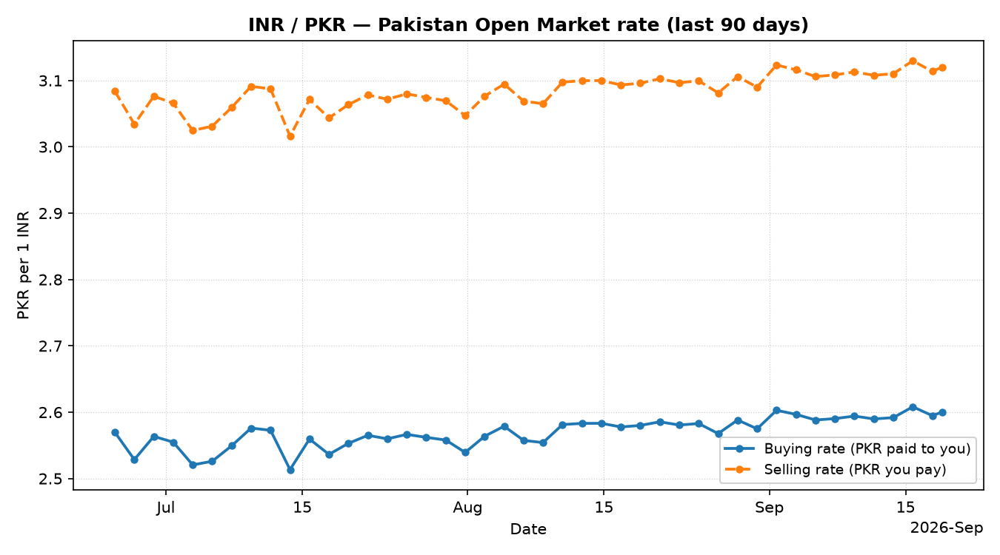
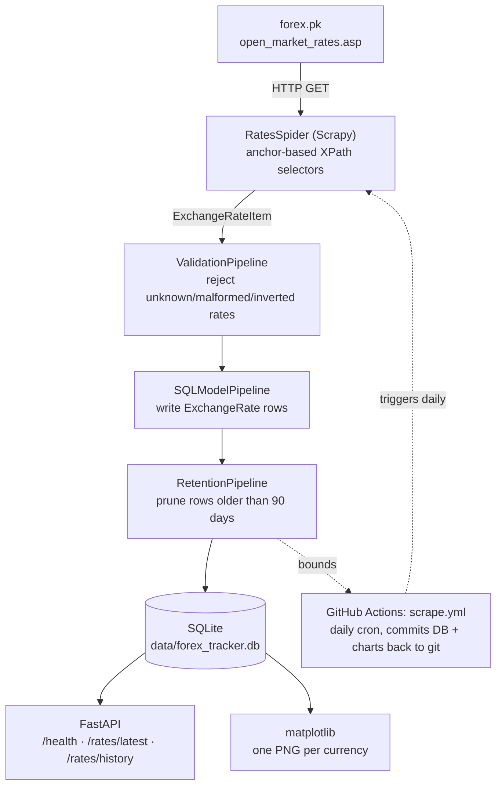

# Forex Tracker

[](https://github.com/Hqasim/forex-tracker/actions/workflows/ci.yml)
[](https://github.com/Hqasim/forex-tracker/actions/workflows/scrape.yml)

[](LICENSE)

A small, production-shaped data pipeline: a **Scrapy** spider scrapes
Pakistan's daily open-market currency rates (USD, EUR, CNY, SAR, and INR
against PKR — both **buying** and **selling**), validates and persists them
to **SQLite**, and a **FastAPI** service plus **matplotlib** charts expose
the resulting history. A GitHub Actions workflow runs the scrape on a
schedule so the dataset grows on its own, bounded to a rolling **90-day**
window.

This started as a one-off scraping script; it's since been rebuilt around
resilient selectors, data validation, a typed persistence layer, automated
retention, a real test suite, and CI. The sections below are written for two
readers: if you're skimming this as a portfolio piece, **What this
demonstrates** and the screenshots are the fastest path to an impression; if
you're evaluating the engineering itself, **Architecture** and
**Design decisions** are where the actual reasoning lives.

## What this demonstrates

- **Resilient scraping** — selectors anchored to semantic content (a
  currency-code cell), not table position; the spider logs and continues
  rather than crashing when a row goes missing.
- **A layered pipeline with a single responsibility per stage** —
  validate → persist → retain, each independently testable (see
  `tests/test_pipelines.py`, `tests/test_retention.py`).
- **Financial-data correctness** — `Decimal` throughout (never `float`) for
  anything that's actually a currency amount.
- **A typed, strict codebase** — `mypy --strict` clean across the project;
  SQLModel gives one class that's simultaneously the ORM model and the
  FastAPI response schema, so there's no hand-maintained DTO to drift out
  of sync with the database.
- **Automated, bounded data growth** — a scheduled workflow scrapes daily
  and commits the result back to git; a retention pipeline keeps that
  growth capped at 90 days instead of unbounded.
- **A real test suite, not a token one** — 20 tests, entirely offline (a
  saved HTML fixture stands in for the live site), covering the spider's
  parsing, the validation pipeline's edge cases, retention pruning, the
  API, and chart rendering.
- **CI across three Python versions** (3.12–3.14), lint + type-check + test
  on every push.

## Screenshots

Each tracked currency renders as its own chart — deliberately, not as one
shared plot. USD trades around 278 PKR and INR around 2.6–3 PKR; on a single
shared y-axis, INR's own trend would be flattened to a near-invisible line
near zero. A separate, auto-scaled y-axis per currency is what actually
makes every trend readable.

| | |
|---|---|
|  |  |
|  |  |
|  | |

> These are `forex-tracker chart`'s real output against this repo's own
> scraped data, with a handful of synthetic historical points layered in
> locally purely so the trend and the x-axis's day→month compression are
> visible in a single screenshot — the live scheduled automation has only
> run a few times so far, so its *genuine* history is still short. As the
> workflow keeps running daily, these become authentic 90-day trends;
> regenerate them any time with `forex-tracker chart`.
>
> Add further screenshots (a terminal run of `forex-tracker scrape`, the
> Swagger UI at `http://127.0.0.1:8000/docs`, an example API response) to
> `docs/screenshots/` and reference them here.

## Architecture



Read top to bottom: one HTTP request produces one `ExchangeRateItem` per
tracked currency, which flows through three single-purpose Scrapy
pipeline stages (in priority order, see `scraper/settings.py`) before
landing in SQLite. From there, two independent consumers read the same
table: the FastAPI service (for programmatic access) and the chart
module (for the PNGs above) — neither writes to it, keeping the write
path (the pipeline) and the read paths cleanly separated.

## Requirements

- Python **3.12+** (developed and tested against **3.14.7**)
- No external services — SQLite is a plain file, no database server needed

## Setup

```bash
git clone https://github.com/Hqasim/forex-tracker.git
cd forex-tracker

# Create and activate a virtual environment
python -m venv .venv
source .venv/Scripts/activate      # Git Bash on Windows
# .venv\Scripts\activate.bat       # cmd.exe
# .venv\Scripts\Activate.ps1       # PowerShell
# source .venv/bin/activate        # macOS / Linux

# Install the project, plus dev tools (pytest, ruff, mypy, pre-commit)
pip install -e ".[dev]"

# Optional: run the same checks CI runs, locally
pytest
ruff check .
mypy src
```

That's the entire setup — no database server, no `.env` file, no external
account to create. `pip install -e .` also registers the `forex-tracker`
console script used below.

## Usage

Every command below is a subcommand of the installed `forex-tracker` CLI
(`src/forex_tracker/cli.py`, built with Typer). Run `forex-tracker --help`
or `forex-tracker <command> --help` for the full option list.

```bash
# 1. Scrape the current open-market rates into data/forex_tracker.db
forex-tracker scrape
```
```text
2026-09-18 22:47:13 [scrapy.core.engine] INFO: Spider opened
2026-09-18 22:47:13 [scrapy.extensions.logstats] INFO: Crawled 0 pages (at 0 pages/min), scraped 0 items (at 0 items/min)
2026-09-18 22:47:13 [scrapy.core.engine] INFO: Closing spider (finished)
'item_scraped_count': 5,
```

```bash
# 2. Serve the API at http://127.0.0.1:8000 (interactive docs at /docs)
forex-tracker serve

# 3. Render a chart per currency into docs/screenshots/
forex-tracker chart

# ...or just one currency, into a directory of your choice
forex-tracker chart USD --output-dir /tmp/charts --since-days 30
```

The original Scrapy invocation still works too, if you just want a raw JSON
feed instead of the SQLite history (run from the repo root, where
`scrapy.cfg` lives):

```bash
scrapy crawl rates -o rates.json
```

### Tracked currencies

`USD`, `EUR`, `CNY`, `SAR`, `INR` — each quoted as **buying** and
**selling** PKR rates from forex.pk's Pakistan Open Market table (distinct
from forex.pk's interbank/international rate table, which quotes
differently and carries no buy/sell spread).

## Consuming the API

Start the server first: `forex-tracker serve` (defaults to
`http://127.0.0.1:8000`). Every endpoint below is also documented
interactively at `/docs` (Swagger UI) and `/redoc`.

| Method | Endpoint | Description |
| --- | --- | --- |
| `GET` | `/health` | Liveness check; doesn't touch the database |
| `GET` | `/rates/latest` | Most recent buy/sell rate for every tracked currency |
| `GET` | `/rates/history?currency=<code>&days=<1-90>` | Chronological buy/sell history for one currency, oldest first |

**Example: latest rates**

```bash
curl http://127.0.0.1:8000/rates/latest
```

```json
[
  {
    "id": 3,
    "currency": "CNY",
    "buy_rate": "38.250000",
    "sell_rate": "38.970000",
    "source": "forex.pk",
    "source_updated_at": "Fri, Sep 18 2026, 22:39 PST (GMT+5)",
    "scraped_at": "2026-09-18T17:47:53.369862",
    "recorded_at": "2026-09-18T17:47:53.404568"
  },
  {
    "id": 1,
    "currency": "USD",
    "buy_rate": "278.000000",
    "sell_rate": "278.300000",
    "source": "forex.pk",
    "source_updated_at": "Fri, Sep 18 2026, 22:39 PST (GMT+5)",
    "scraped_at": "2026-09-18T17:47:53.369862",
    "recorded_at": "2026-09-18T17:47:53.374311"
  }
]
```

**Example: 30 days of USD history**

```bash
curl "http://127.0.0.1:8000/rates/history?currency=USD&days=30"
```

Requesting a currency this API doesn't track (or one with no rows in the
requested window) returns `404`, not an empty list — that distinction
matters to a caller deciding how to react:

```bash
curl -i "http://127.0.0.1:8000/rates/history?currency=ZZZ"
# HTTP/1.1 404 Not Found
# {"detail":"No history for currency 'ZZZ'"}
```

**From Python**, using [`httpx`](https://www.python-httpx.org/) (already a
transitive dependency, via `fastapi.testclient`):

```python
import httpx

response = httpx.get("http://127.0.0.1:8000/rates/latest")
response.raise_for_status()
for rate in response.json():
    print(f"{rate['currency']}: buy {rate['buy_rate']} / sell {rate['sell_rate']} PKR")
```

## Data retention

The store keeps a rolling **90-day (three-month)** window only:

- `RetentionPipeline` deletes any row older than 90 days at the end of
  every scrape run, so the SQLite file — and the size of the commit the
  scheduled workflow pushes — stays bounded instead of growing forever.
- `GET /rates/history` caps `days` at 90 for the same reason: asking for
  more wouldn't return anything the store no longer has.
- `forex-tracker chart` defaults to the same 90-day window.

`RETENTION_DAYS` lives in exactly one place
(`src/forex_tracker/constants.py`) and is reused by the pipeline, the API,
and the chart command, so the window can't drift out of sync between them.

## Development & code quality

```bash
ruff check .                  # lint
ruff format .                 # format
mypy src                      # type-check (strict mode, zero warnings)
pytest --cov=forex_tracker    # 20 tests, fully offline — no network calls
pre-commit install            # run all of the above automatically on commit
```

Notes for anyone reading the source directly:

- Every module carries a docstring explaining *why* it's built the way it
  is, not just what it does — the reasoning behind a non-obvious choice
  (an XPath quirk, a timezone gotcha, a deliberate scale tradeoff in the
  charts) is written down next to the code it explains, not left implicit.
- Spider tests run against a saved HTML fixture in `tests/fixtures/`, so
  the suite never depends on forex.pk being reachable or unchanged
  mid-test-run — and still exercises the real parsing logic, not a mock
  of it.
- `mypy --strict` is enforced project-wide except the spiders package
  (Scrapy's dynamically-typed `Item`/`Field` API doesn't fit strict mode
  cleanly; see the `[tool.mypy]` exclusion in `pyproject.toml`).

> **Schema note:** the rate table's schema changed (PKR buy/sell rates
> instead of a single units-per-USD figure) earlier in this project's
> history. There's no migration tooling yet (see Design decisions), so a
> `data/forex_tracker.db` from before that change won't load correctly —
> delete it and run `forex-tracker scrape` again.

## Automation

`.github/workflows/scrape.yml` runs `forex-tracker scrape` daily,
regenerates every currency's chart, and commits both back to the repo — so
the commit history itself is a visible, running record of the pipeline
working, not just a claim in this README. Because `RetentionPipeline` runs
as part of every scrape, that committed history never grows past roughly 90
days of data. `.github/workflows/ci.yml` lints, type-checks, and tests on
every push across Python 3.12, 3.13, and 3.14.

## Design decisions

- **Anchor-based selectors, not absolute XPath.** The original spider used
  paths like `/html/body/table/tr[1]/td[2]/table/...`, which break on any
  incidental layout change. The current spider locates each row by its
  currency-code cell instead (`normalize-space(td[2])="EUR"`, evaluated
  against the whole cell since this table nests the code in an `<a>`), and
  logs a warning — rather than crashing or silently emitting `None` — if a
  currency disappears from the page.
- **`ROBOTSTXT_OBEY = True`, `allowed_domains`, a real `USER_AGENT`, and
  `AUTOTHROTTLE`** are deliberate choices to scrape politely and stay
  scoped to forex.pk, rather than as fast/broadly as technically possible.
- **Validation before persistence.** A dedicated pipeline stage rejects
  unknown currency codes, non-numeric/non-positive rates, and a selling
  rate quoted below the buying rate (an impossible market spread) before
  anything reaches SQLite, so a partially-broken page can't corrupt the
  history.
- **A 90-day retention window.** Rather than let the store — and the
  binary `.db` file the scheduled workflow commits — grow forever, a
  dedicated pipeline stage prunes anything older than `RETENTION_DAYS`
  after every run. The same constant bounds the API's history endpoint and
  the chart command, so "how much history exists" has one answer
  everywhere it's asked.
- **SQLite over a hosted database.** For a single-writer, low-volume
  history like this, a file-based store keeps the project runnable with
  zero infrastructure. If this needed multiple writers or larger scale,
  the natural next step is Postgres + Alembic migrations (SQLModel already
  gives a straightforward migration path there).
- **`Decimal`, not `float`, for rates.** Exchange rates are financial
  data; storing them as `Decimal` avoids floating-point representation
  error creeping into stored history.
- **One chart per currency, not one shared plot.** All five currencies'
  PKR values span roughly two orders of magnitude; a shared y-axis would
  flatten the smaller ones. Each currency instead gets its own figure with
  its own auto-scaled axis, buying and selling drawn as distinct
  solid/dashed series, and a
  `matplotlib.dates.AutoDateLocator`/`ConciseDateFormatter` pair on the
  x-axis so tick labels compress automatically from days to months as the
  plotted span grows, instead of a fixed interval that would get
  unreadable over 90 days.

## Possible extensions

Ideas for taking this further, roughly in order of effort:

- Second spider for the interbank rate table too, with a reconciliation
  step that flags disagreements against the open-market rates here.
- Alerting (email/Slack webhook) when a rate crosses a configured
  threshold.
- Swap SQLite for Postgres with Alembic migrations if this needed
  concurrent writers or longer-than-90-day retention.
- Dockerize and deploy the API somewhere publicly reachable (Fly.io,
  Railway, Render).

## License

[MIT](LICENSE)
